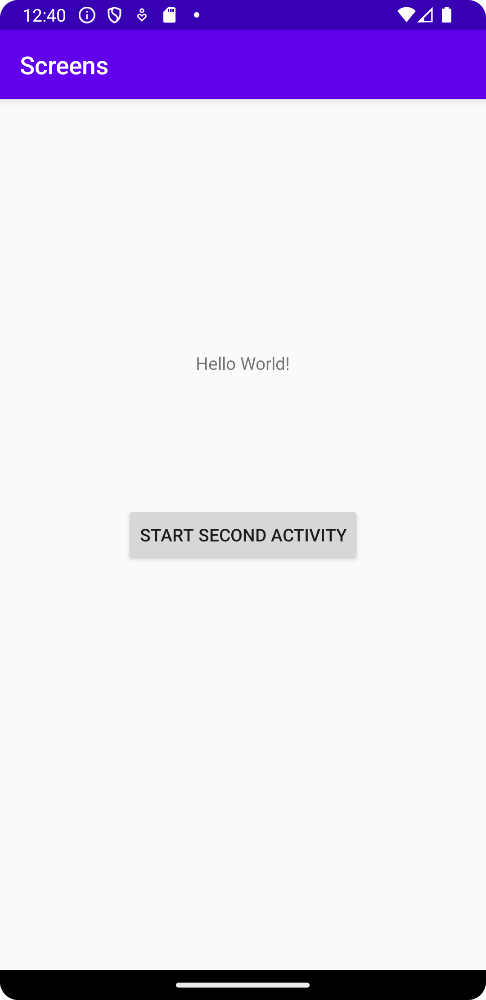
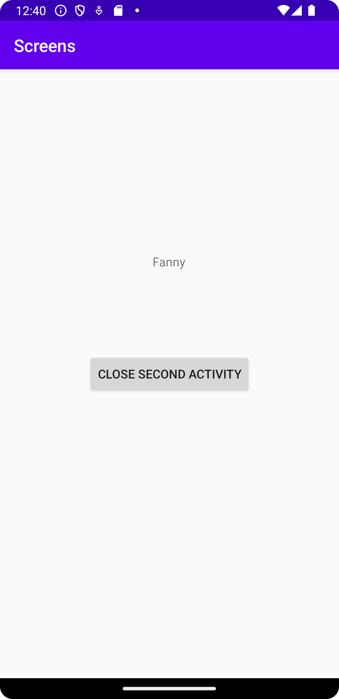

# Rapport
Skapade knapp som startar SecondActivity.java, och intent i MainActivity.java.
Intentet som skickar över är texten i intent.putExtra();.

``
Button button = findViewById(R.id.start_second_activity);
button.setOnClickListener(new View.OnClickListener(){
    @Override
    public void onClick(View view) {
    Intent intent = new Intent(MainActivity.this, SecondActivity.class);
    intent.putExtra("name", "Nu är du på SecondActivity");
    startActivity(intent);
}
});
``
Intentet hämtas i SecondActivity.java (OM det har ett värde som inte är null visas strängen)
``
Bundle extras = getIntent().getExtras();
if (extras != null) {
    String name = extras.getString("name");
    textView.setText(name);
}
``
Även en knapp för att avsluta SecondActivity.java skapades
``
Button close = findViewById(R.id.close_second_activity);
close.setOnClickListener(new View.OnClickListener() {
    @Override
    public void onClick(View view){
    finish();
    }
});
``
- MainActivity:

- SecondActivity

